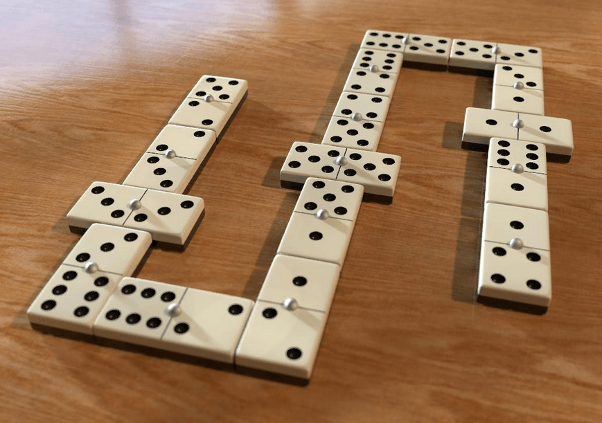
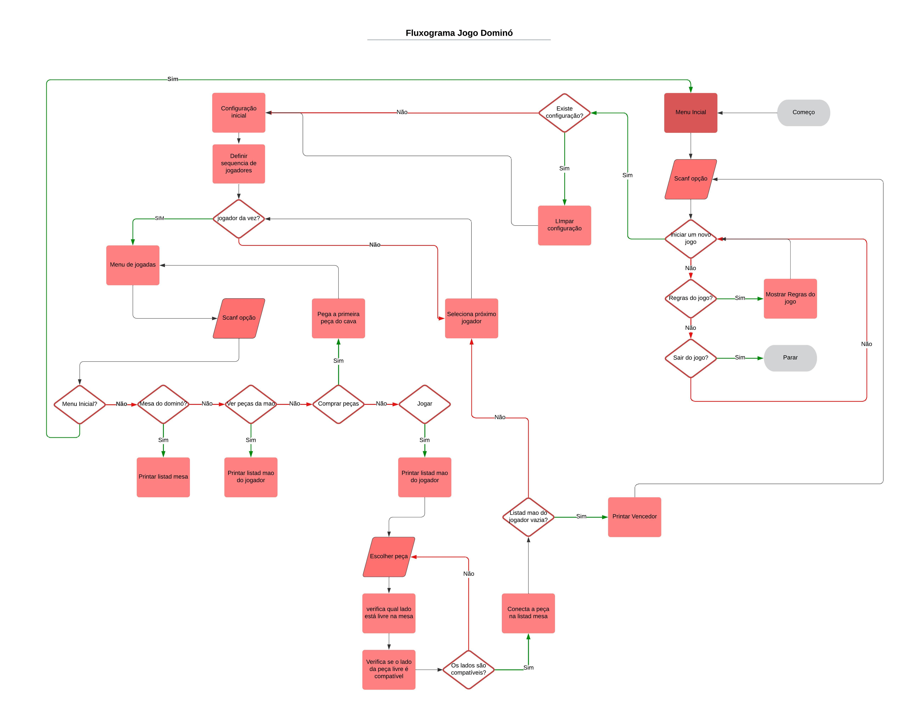

## EQUIPE
- André Lucas
- Rodrigo Macedo

# Dominó

O dominó é um jogo antigo e popular, originado na China por volta de 243 a.C., composto por 28 peças. Este projeto propõe a implementação de um programa que permita a participação de dois ou quatro jogadores no jogo. O jogo começa com todas as peças embaralhadas e distribuídas entre os jogadores. Cada jogador, em seu turno, escolhe uma peça para colocar em uma das extremidades da sequência na mesa. Caso não tenha uma peça válida, o jogador deve retirar do monte. O jogo encerra quando o primeiro jogador esvaziar sua mão.

  

# Como o Programa Funciona?

O jogo envolve dois ou quatro jogadores e um conjunto de peças de dominó. Cada peça de dominó tem duas faces com números de 0 a 6. O objetivo do jogo é ser o primeiro jogador a se livrar de todas as suas peças.

  

# Explicação do código do Jogo de Dominó

## Início

### Iniciando o Jogo

1. **Embaralhar e Distribuir Peças:**
   - As peças de dominó devem ser embaralhadas e distribuídas igualmente entre os jogadores. O número de jogadores pode variar entre 2 e 4 jogadores.
   - Cada jogador deve receber 7 peças de dominó.

2. **Colocar a Primeira Peça:**
   - O jogador que tiver a maior bucha (peça com os dois lados iguais), é definido como o primeiro jogador e a peça é automaticamente anexada na mesa. 

## Jogada dos Jogadors

### Selecionar Peça

1. O jogador da vez deve escolher uma peça da sua mão que combine com a peça da mesa.
   - Uma peça combina se um dos seus números for igual ao número da peça do centro.

### Jogar Peça

1. A peça selecionada deve ser colocada na mesa.
   - A peça deve ser colocada de forma que os números combinem.

### Pegar Peça no cava

1. Se o jogador não tiver nenhuma peça que combine, ele deve pegar uma peça do cava de peças.
2. Se o monte estiver vazio, o jogador passa a vez sem jogar.

## Fim da Jogada

1. A jogada do jogador termina após colocar a peça ou pegar uma peça do monte.
2. O próximo jogador segue com a sua jogada.

## Fim da Rodada

### Verificação de Vitória

1. Ao final do jogador é verificado se não exite mais peças na mão do jogador da vez peças.
   - Se sim, o jogador vence a rodada.
   - Se nenhum jogador se livrar de todas as peças e não tiver mais como jogar a rodada termina e vence quem tiver menos pontos

# Intruções e requisitos para o trabalho

- [x] **Criar peças:** Criar todas as peças do jogo. 
- [x] **Número de Jogadores:** O programa deve suportar dois ou quatro jogadores. 
- [x] **Nomes dos Jogadores:** Deve ser solicitado o nome dos jogadores no início do jogo.
- [x] **Estruturas de Dados:** Utilize as estruturas de dados e algoritmos mais adequados para resolver o problema.
- [x] **Alocação Dinâmica:** Implemente a sequência de peças na mesa utilizando alocação dinâmica.
- [x] **Ordenação das Peças:** Mantenha as peças na mão dos jogadores sempre ordenadas pelo somatório dos números nelas contidos.
- [x] **Documentação:** Documente o algoritmo com comentários claros para facilitar a compreensão e manutenção do código.
- [X] **Criação de mão do jogador:** implementar uma estrutura de dados para a criação. 

- [ ] **implementação de regras do jogo :** codificar as regras de negocio as regras do jogo .
- [ ] **interação mão mesa:**  implementar as retiradas e inserções das diferentes estruturas de dados prioridade ####.
- [X]  **Distribuição de pedras nas mão dos jogadores:** destribuir de forma aleatoria as pedras disponiveis no cava .
- [ ] **Documentação :**  Seguir boas praticas e descrever o que cada trecho do codigo     faz .
- [X] **Modularização  :**  Seguir boas praticas e separar bem as responsabilidades de cada função  .
> [!IMPORTANT] 
>  O jogo termina quando o primeiro jogador "baixar" todas as suas peças na mesa.
