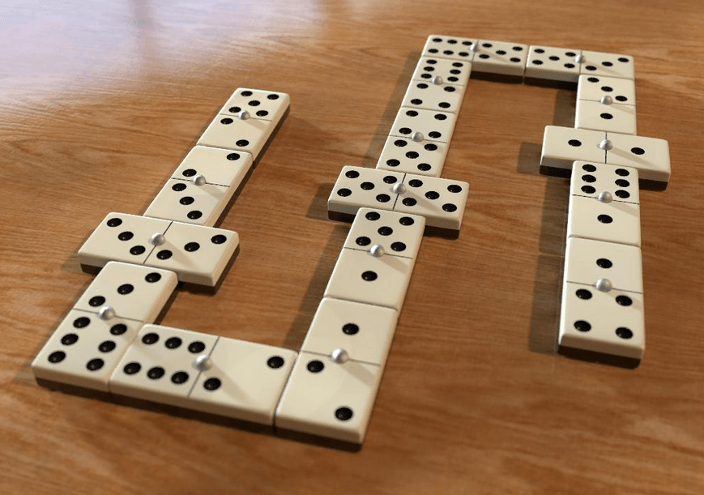

## EQUIPE
- André Lucas
- Rodrigo Macedo

# Dominó

O dominó é um jogo antigo e popular, originado na China por volta de 243 a.C., composto por 28 peças. Este projeto propõe a implementação de um programa que permita a participação de dois ou quatro jogadores no jogo. O jogo começa com todas as peças embaralhadas e distribuídas entre os jogadores. Cada jogador, em seu turno, escolhe uma peça para colocar em uma das extremidades da sequência na mesa. Caso não tenha uma peça válida, o jogador deve retirar do monte. O jogo encerra quando o primeiro jogador esvaziar sua mão.

  

## Intruções e requisitos

- [x] **Criar peças:** Criar todas as peças do jogo. 
- [x] **Número de Jogadores:** O programa deve suportar dois ou quatro jogadores. 
- [x] **Nomes dos Jogadores:** Deve ser solicitado o nome dos jogadores no início do jogo.
- [x] **Estruturas de Dados:** Utilize as estruturas de dados e algoritmos mais adequados para resolver o problema.
- [x] **Alocação Dinâmica:** Implemente a sequência de peças na mesa utilizando alocação dinâmica.
- [x] **Ordenação das Peças:** Mantenha as peças na mão dos jogadores sempre ordenadas pelo somatório dos números nelas contidos.
- [x] **Documentação:** Documente o algoritmo com comentários claros para facilitar a compreensão e manutenção do código.
- [X] **Criação de mão do jogador:** implementar uma estrutura de dados para a criação. 

- [] **implementação de regras do jogo :** codificar as regras de negocio as regras do jogo .
- [] **interação mão mesa:**  implementar as retiradas e inserções das diferentes estruturas de dados prioridade ####.
- [X]  **Distribuição de pedras nas mão dos jogadores:** destribuir de forma aleatoria as pedras disponiveis no cava .
- [] **Documentação :**  Seguir boas praticas e descrever o que cada trecho do codigo     faz .
- [X] **Modularização  :**  Seguir boas praticas e separar bem as responsabilidades de cada função  .
> [!IMPORTANT] 
>  O jogo termina quando o primeiro jogador "baixar" todas as suas peças na mesa.
